<h4 align="center">
  
  
  <a href="https://rdagent.azurewebsites.net" target="_blank">🖥️ Live Demo</a> |
  <a href="https://rdagent.azurewebsites.net/factor_loop" target="_blank">🎥 Demo Video</a> <a href="https://www.youtube.com/watch?v=JJ4JYO3HscM&list=PLALmKB0_N3_i52fhUmPQiL4jsO354uopR" target="_blank">▶️YouTube</a>   |
  <a href="https://rdagent.readthedocs.io/en/latest/index.html" target="_blank">📖 Documentation</a> |
  <a href="https://aka.ms/RD-Agent-Tech-Report" target="_blank">📄 Tech Report</a> |
  <a href="#-research--publications"> 📃 Papers </a>
</h3>

[](https://github.com/microsoft/RD-Agent/actions/workflows/ci.yml)
[](https://github.com/microsoft/RD-Agent/actions/workflows/github-code-scanning/codeql)
[](https://pypi.org/project/rdagent/)
[](https://pypi.org/project/rdagent/)
[](https://github.com/microsoft/RD-Agent/blob/main/DOCKER.md)
[](https://github.com/microsoft/RD-Agent/blob/main/rdagent/app/gateway/README.md)
[](https://github.com/microsoft/RD-Agent/blob/main/LICENSE)
[](https://discord.gg/ybQ97B6Jjy)
[](https://arxiv.org/abs/2505.14738)

---

<div align="center">
  <h1>🤖 RD-Agent: The Leading AI Agent for Research & Development</h1>
  <p><strong>Autonomous agent framework for data-driven research, development, and scientific discovery</strong></p>
</div>

---

## 📑 Table of Contents

- [🏆 Achievements](#-achievements)
- [🌟 Overview](#-overview) 
- [🏗️ Architecture](#️-architecture)
- [🚀 Quick Start](#-quick-start)
- [🐳 Docker Deployment](#-docker-deployment)
- [🔧 Core Features](#-core-features)
- [📋 Usage Examples](#-usage-examples)
- [🎯 Scenarios & Applications](#-scenarios--applications)
- [📊 Monitoring & Management](#-monitoring--management)
- [🔗 OpenAI-Compatible API](#-openai-compatible-api)
- [🛠️ Development](#️-development)
- [📚 Research & Publications](#-research--publications)
- [🤝 Contributing](#-contributing)
- [🆘 Support](#-support)

---

## 🏆 Achievements

### 🥇 Top-Performing Machine Learning Engineering Agent

[MLE-bench](https://github.com/openai/mle-bench) evaluates AI agents on machine learning engineering tasks across 75 Kaggle competitions.

**R&D-Agent leads the leaderboard:**

| Agent | Low/Lite (%) | Medium (%) | High (%) | Overall (%) |
|-------|-------------|------------|----------|-------------|
| **R&D-Agent o1-preview** | **48.18 ± 2.49** | **8.95 ± 2.36** | **18.67 ± 2.98** | **22.4 ± 1.1** |
| **R&D-Agent o3(R)+GPT-4.1(D)** | **51.52 ± 6.21** | **7.89 ± 3.33** | **16.67 ± 3.65** | **22.45 ± 2.45** |
| AIDE o1-preview | 34.3 ± 2.4 | 8.8 ± 1.1 | 10.0 ± 1.9 | 16.9 ± 1.1 |

🔗 **Detailed Results:** [o1-preview runs](https://aka.ms/RD-Agent_MLE-Bench_O1-preview) | [o3+GPT-4.1 runs](https://aka.ms/RD-Agent_MLE-Bench_O3_GPT41)

### 🥇 First Data-Centric Quantitative Finance Framework

**RD-Agent(Q)** achieves 2× higher ARR than benchmark factor libraries at <$10 cost, using 70% fewer factors.

---

## 🌟 Overview

**RD-Agent** is a comprehensive framework that automates the entire research and development lifecycle through AI agents. It combines the power of "R" (Research - idea generation) and "D" (Development - implementation) to create autonomous systems capable of:

- 📄 **Reading and Understanding** research papers, reports, and documentation
- 🧠 **Generating Novel Ideas** based on current knowledge and observations  
- 🛠️ **Implementing Solutions** through executable code and experiments
- 🔄 **Iterative Improvement** via feedback loops and knowledge evolution
- 🚀 **Autonomous Deployment** with production-ready systems

### 🎯 Key Applications

```mermaid
mindmap
  root((RD-Agent))
    💹 Finance
      Factor Discovery
      Model Optimization
      Risk Management
      Algorithmic Trading
    🏥 Healthcare
      Drug Discovery
      Medical Imaging
      Clinical Research
      Biomarker Analysis
    🤖 Machine Learning
      AutoML Pipelines
      Feature Engineering
      Model Architecture Search
      Hyperparameter Tuning
    🔬 General Research
      Paper Implementation
      Experiment Design
      Data Analysis
      Scientific Discovery
```



---

## 🏗️ Architecture

### System Architecture Overview


### CoSTEER Framework (Collaborative Evolving Strategy)

```mermaid
graph LR
    subgraph "Research Phase (R)"
        IDEA[💡 Idea Generation]
        DESIGN[📐 Experiment Design]  
        HYPOTHESIS[🧪 Hypothesis Formation]
    end
    
    subgraph "Development Phase (D)"
        CODE[👨‍💻 Code Implementation]
        TEST[🧪 Testing & Validation]
        DEPLOY[🚀 Deployment]
    end
    
    subgraph "Evolution Loop"
        FEEDBACK[📊 Performance Feedback]
        LEARN[🧠 Knowledge Update]
        IMPROVE[⚡ Iterative Improvement]
    end
    
    IDEA --> DESIGN
    DESIGN --> HYPOTHESIS
    HYPOTHESIS --> CODE
    CODE --> TEST
    TEST --> DEPLOY
    DEPLOY --> FEEDBACK
    FEEDBACK --> LEARN
    LEARN --> IMPROVE
    IMPROVE --> IDEA
    
    style IDEA fill:#e1f5fe
    style CODE fill:#f3e5f5
    style FEEDBACK fill:#e8f5e8
```



### Data Flow Architecture


---

## 🚀 Quick Start

### Prerequisites

- Python 3.10+ 
- Docker (for isolated execution)
- 4GB+ RAM
- API keys for LLM providers

### Installation

#### Option 1: PyPI Installation (Recommended)

```bash
# Install RD-Agent
pip install rdagent

# Health check
rdagent health_check
```

#### Option 2: Development Installation

```bash
# Clone repository
git clone https://github.com/microsoft/RD-Agent.git
cd RD-Agent

# Install in development mode
make dev

# Health check
rdagent health_check
```

### Configuration

Create a `.env` file with your API keys:

```bash
# LLM Configuration
OPENAI_API_KEY=your_openai_api_key
CHAT_MODEL=gpt-4o
EMBEDDING_MODEL=text-embedding-3-small

# Alternative: DeepSeek (Cost-effective)
# DEEPSEEK_API_KEY=your_deepseek_api_key
# CHAT_MODEL=deepseek/deepseek-chat

# Optional: Advanced settings
# REASONING_THINK_RM=True  # For reasoning models
```

### First Run

```bash
# Start a simple data science project
rdagent data_science --competition sf-crime

# Start quantitative finance analysis
rdagent fin_factor

# Implement a research paper
rdagent general_model "https://arxiv.org/pdf/2210.09789"

# Monitor results
rdagent ui --port 19899 --log_dir log/
```

---

## 🐳 Docker Deployment

### Quick Start with Docker

```bash
# Clone and setup
git clone https://github.com/microsoft/RD-Agent.git
cd RD-Agent

# Setup environment
cp .env.docker .env
# Edit .env with your API keys

# Quick start (minimal)
docker-compose -f docker-compose.minimal.yml up -d

# Check status
curl http://localhost:8000/health
```

### Deployment Options

#### 1. Minimal Deployment (Gateway Only)
```bash
docker-compose -f docker-compose.minimal.yml up -d
```
- ✅ OpenAI-compatible API gateway
- ✅ Health checks
- 🚀 Fastest startup, minimal resources

#### 2. Development Environment
```bash
make -f Makefile.docker quick-start
# or
docker-compose -f docker-compose.yml -f docker-compose.dev.yml up -d
```
- ✅ Gateway with hot reload
- ✅ UI monitoring dashboard  
- ✅ Redis caching
- ✅ Nginx reverse proxy

#### 3. Production Environment
```bash
docker-compose -f docker-compose.yml -f docker-compose.prod.yml up -d
```
- ✅ Multiple gateway replicas
- ✅ Production database with backups
- ✅ SSL-ready configuration
- ✅ Resource limits and monitoring

#### 4. Full Stack with Monitoring
```bash
docker-compose --profile monitoring up -d
```
- ✅ Complete monitoring stack
- ✅ Prometheus + Grafana
- ✅ Performance dashboards
- ✅ Alert management

### Service Architecture


### Docker Management Commands

```bash
# Build and start
make -f Makefile.docker docker-build
make -f Makefile.docker docker-up-dev

# Health check
make -f Makefile.docker docker-health

# View logs  
make -f Makefile.docker docker-logs

# Shell access
make -f Makefile.docker docker-shell

# Cleanup
make -f Makefile.docker docker-clean
```

📖 **Complete Docker Guide:** [DOCKER.md](DOCKER.md)

---

## 🔧 Core Features

### 🧠 Autonomous Research Capabilities

```mermaid
graph LR
    subgraph "Knowledge Acquisition"
        READ[📖 Document Reading]
        EXTRACT[🔍 Information Extraction]
        UNDERSTAND[🧠 Concept Understanding]
    end
    
    subgraph "Idea Generation"
        ANALYZE[📊 Pattern Analysis]
        PROPOSE[💡 Hypothesis Generation]
        DESIGN[📐 Experiment Design]
    end
    
    subgraph "Implementation"
        CODE[👨‍💻 Code Generation]
        TEST[🧪 Testing]
        OPTIMIZE[⚡ Optimization]
    end
    
    READ --> EXTRACT
    EXTRACT --> UNDERSTAND
    UNDERSTAND --> ANALYZE
    ANALYZE --> PROPOSE
    PROPOSE --> DESIGN
    DESIGN --> CODE
    CODE --> TEST
    TEST --> OPTIMIZE
    OPTIMIZE --> READ
```



### 🛠️ Development Automation

- **Automated Code Generation**: From high-level descriptions to production code
- **Intelligent Testing**: Comprehensive test suite generation and execution
- **Performance Optimization**: Automatic bottleneck detection and improvement
- **Documentation**: Auto-generated docs and comments
- **Version Control**: Automated git workflows and branching

### 🔄 Continuous Learning

- **Feedback Integration**: Learn from execution results and user feedback
- **Knowledge Evolution**: Continuously expanding knowledge base
- **Pattern Recognition**: Identify successful strategies and patterns
- **Adaptive Behavior**: Adjust strategies based on domain and context

### 🌐 Multi-Domain Expertise

- **Data Science**: Feature engineering, model selection, ensemble methods
- **Quantitative Finance**: Factor discovery, backtesting, portfolio optimization
- **Research**: Paper analysis, methodology extraction, result reproduction
- **Software Engineering**: Architecture design, code review, deployment

---

## 📋 Usage Examples

### OpenAI-Compatible API Usage

```python
from openai import OpenAI

# Initialize RD-Agent client
client = OpenAI(
    api_key="your-rd-agent-api-key",
    base_url="http://localhost:8000/v1"
)

# Start a data science project
response = client.chat.completions.create(
    model="rd-agent-data-science",
    messages=[
        {"role": "user", "content": "Analyze the Titanic dataset and build a predictive model"}
    ],
    stream=True,
    extra_body={
        "rd_agent": {
            "competition": "titanic",
            "steps": 5,
            "log_level": "INFO"
        }
    }
)

# Stream results
for chunk in response:
    if chunk.choices[0].delta.content:
        print(chunk.choices[0].delta.content, end="")
```

### Command Line Interface

```bash
# Data Science Scenarios
rdagent data_science --competition titanic
rdagent data_science --competition house-prices

# Quantitative Finance
rdagent fin_quant                    # Joint factor-model optimization
rdagent fin_factor                   # Factor discovery
rdagent fin_model                    # Model evolution

# Research Paper Implementation
rdagent general_model "https://arxiv.org/pdf/2106.04560"
rdagent general_model --paper-path ./research_paper.pdf

# Financial Report Analysis
rdagent fin_factor_report --report_folder ./financial_reports/
```

### Python API

```python
from rdagent.scenarios.data_science import DataScienceScenario
from rdagent.core.evolving_framework import EvolvingFramework

# Initialize scenario
scenario = DataScienceScenario(competition="titanic")

# Create evolving framework
framework = EvolvingFramework(scenario)

# Run evolution loop
results = framework.run(max_iterations=10)

# Access results
for result in results:
    print(f"Iteration {result.iteration}: Score = {result.score}")
```

### cURL Examples

```bash
# List available models
curl http://localhost:8000/v1/models

# Chat completion
curl -X POST http://localhost:8000/v1/chat/completions \
  -H "Authorization: Bearer your-api-key" \
  -H "Content-Type: application/json" \
  -d '{
    "model": "rd-agent-data-science",
    "messages": [{"role": "user", "content": "Start sf-crime analysis"}],
    "stream": true,
    "rd_agent": {
      "competition": "sf-crime",
      "steps": 3
    }
  }'

# Health check
curl http://localhost:8000/health
```

---

## 🎯 Scenarios & Applications

### 📊 Data Science & Machine Learning


**Supported Competitions:**
- Titanic: Machine Learning from Disaster
- House Prices: Advanced Regression
- San Francisco Crime Classification
- Forest Cover Type Prediction
- And 70+ more competitions

### 💹 Quantitative Finance


**Key Features:**
- Automated factor discovery from financial data
- Multi-asset model development
- Risk-adjusted performance optimization
- Real-time portfolio rebalancing

### 🔬 Research & Development


**Capabilities:**
- Automatic paper analysis and understanding
- Method extraction and implementation
- Experimental validation and reproduction
- Performance comparison and improvement

---

## 📊 Monitoring & Management

### Web Dashboard

Access the monitoring dashboard at `http://localhost:19899`

**Features:**
- Real-time execution monitoring
- Performance metrics visualization
- Log aggregation and search
- Experiment comparison
- Resource utilization tracking

### Prometheus Metrics

```bash
# Gateway metrics
curl http://localhost:8000/metrics

# Key metrics tracked:
# - request_count_total
# - request_duration_seconds
# - active_scenarios_gauge
# - execution_success_rate
# - model_inference_time
```

### Grafana Dashboards

Pre-built dashboards available at `http://localhost:3000`:

1. **System Overview**: Resource utilization, service health
2. **API Performance**: Request rates, response times, error rates
3. **Agent Execution**: Scenario performance, success rates
4. **Business Metrics**: Model accuracy, financial returns

### Log Management

```bash
# View real-time logs
docker-compose logs -f rdagent-gateway

# Search logs
docker exec -it rdagent-gateway grep "ERROR" /app/log/*.log

# Log aggregation with ELK stack (optional)
docker-compose --profile elk up -d
```

---

## 🔗 OpenAI-Compatible API

RD-Agent provides a fully OpenAI-compatible REST API, enabling seamless integration with existing tools and workflows.

### API Endpoints

| Endpoint | Method | Description |
|----------|--------|-------------|
| `/v1/chat/completions` | POST | Create chat completion |
| `/v1/models` | GET | List available models |
| `/health` | GET | Health check |
| `/metrics` | GET | Prometheus metrics |
| `/docs` | GET | API documentation |

### Available Models

- `rd-agent-data-science`: Data science and ML competitions
- `rd-agent-quantitative-finance`: Financial modeling and analysis
- `rd-agent-general-model`: Research paper implementation
- `rd-agent-kaggle-*`: Competition-specific models

### Authentication

```bash
# Set API key
export RD_AGENT_API_KEY="your-secure-api-key"

# Enable authentication in docker-compose
RD_AGENT_AUTH_ENABLED=true
```

### Integration Examples

#### LangChain Integration

```python
from langchain_openai import ChatOpenAI

llm = ChatOpenAI(
    openai_api_key="your-rd-agent-api-key",
    openai_api_base="http://localhost:8000/v1",
    model="rd-agent-data-science"
)

response = llm.invoke("Build a machine learning model for fraud detection")
```

#### OpenAI Python Client

```python
import openai

openai.api_key = "your-rd-agent-api-key"
openai.api_base = "http://localhost:8000/v1"

response = openai.ChatCompletion.create(
    model="rd-agent-quantitative-finance",
    messages=[{"role": "user", "content": "Develop a momentum strategy"}]
)
```

📖 **Complete API Guide:** [API Documentation](rdagent/app/gateway/README.md)

---

## 🛠️ Development

### Setting Up Development Environment

```bash
# Clone repository
git clone https://github.com/microsoft/RD-Agent.git
cd RD-Agent

# Install development dependencies
make dev

# Run tests
make test

# Run linting
make lint

# Run type checking
make mypy
```

### Project Structure

```
RD-Agent/
├── rdagent/
│   ├── core/              # Core framework
│   ├── scenarios/         # Domain-specific scenarios
│   ├── components/        # Reusable components
│   ├── app/              # Application entry points
│   └── utils/            # Utility functions
├── tests/                # Test suite
├── docs/                 # Documentation
├── docker/               # Docker configurations
└── examples/             # Usage examples
```

### Testing

```bash
# Run all tests
make test

# Run specific test category
pytest -m "data_science"
pytest -m "quantitative_finance"
pytest -m "offline"

# Run with coverage
make test-coverage
```

### Contributing Guidelines

1. Fork the repository
2. Create a feature branch
3. Make your changes
4. Add tests for new functionality
5. Run the test suite
6. Submit a pull request

📖 **Contributing Guide:** [CONTRIBUTING.md](CONTRIBUTING.md)

---

## 📚 Research & Publications

### Academic Papers

#### Overall Technical Report
- **[R&D-Agent: Automating Data-Driven AI Solution Building Through LLM-Powered Automated Research, Development, and Evolution](https://arxiv.org/abs/2505.14738)**

```bibtex
@misc{yang2024rdagent,
    title={R\&D-Agent: Automating Data-Driven AI Solution Building Through LLM-Powered Automated Research, Development, and Evolution},
    author={Xu Yang and Xiao Yang and Shikai Fang and Bowen Xian and Yuante Li and Jian Wang and Minrui Xu and Haoran Pan and Xinpeng Hong and Weiqing Liu and Yelong Shen and Weizhu Chen and Jiang Bian},
    year={2025},
    eprint={2505.14738},
    archivePrefix={arXiv},
    primaryClass={cs.AI}
}
```

#### Quantitative Finance Framework
- **[R&D-Agent-Quant: A Multi-Agent Framework for Data-Centric Factors and Model Joint Optimization](https://arxiv.org/abs/2505.15155)**

#### Development Methodology
- **[Collaborative Evolving Strategy for Automatic Data-Centric Development](https://arxiv.org/abs/2407.18690)**

#### Benchmarking Research
- **[Towards Data-Centric Automatic R&D](https://arxiv.org/abs/2404.11276)**

### Industry Applications

- **Financial Services**: Factor discovery, algorithmic trading, risk management
- **Healthcare**: Drug discovery, medical imaging, clinical research  
- **Technology**: AutoML, software engineering, system optimization
- **Research Institutions**: Scientific discovery, experiment automation

---

## 🤝 Contributing

We welcome contributions from the community! Here's how you can help:

### Ways to Contribute

- 🐛 **Bug Reports**: Report issues and bugs
- 💡 **Feature Requests**: Suggest new features and improvements
- 📝 **Documentation**: Improve docs and examples
- 🧪 **Testing**: Add test cases and improve coverage
- 💻 **Code**: Implement new features and fix bugs

### Development Process

1. **Fork** the repository
2. **Create** a feature branch (`git checkout -b feature/amazing-feature`)
3. **Commit** your changes (`git commit -m 'Add amazing feature'`)
4. **Push** to the branch (`git push origin feature/amazing-feature`)
5. **Open** a Pull Request

### Code Standards

- Follow PEP 8 style guidelines
- Add type hints to new code
- Write comprehensive tests
- Update documentation for new features
- Ensure all CI checks pass

```bash
# Pre-commit hooks
pre-commit install

# Run linting
make lint

# Run tests
make test
```

---

## 🆘 Support

### Getting Help

- 📖 **Documentation**: [https://rdagent.readthedocs.io](https://rdagent.readthedocs.io)
- 💬 **Discord**: [Join our community](https://discord.gg/ybQ97B6Jjy)
- 🐛 **Issues**: [GitHub Issues](https://github.com/microsoft/RD-Agent/issues)
- 📧 **Email**: Contact the maintainers

### Common Issues

#### Docker Permission Denied
```bash
# Add user to docker group
sudo usermod -aG docker $USER
newgrp docker
```

#### Port Already in Use
```bash
# Find process using port
sudo lsof -i :8000
# Kill process or change port in configuration
```

#### API Key Issues
```bash
# Verify environment variables
echo $OPENAI_API_KEY
# Check .env file configuration
cat .env
```

### Health Check

```bash
# System health check
rdagent health_check

# Docker health check  
make -f Makefile.docker docker-health

# API health check
curl http://localhost:8000/health
```

### Troubleshooting

1. **Check logs**: `docker-compose logs rdagent-gateway`
2. **Verify configuration**: Ensure API keys are set correctly
3. **Check resources**: Ensure sufficient memory and disk space
4. **Network connectivity**: Verify access to external APIs
5. **Docker setup**: Ensure Docker is running and accessible

---

## 📄 License

This project is licensed under the MIT License - see the [LICENSE](LICENSE) file for details.

---

## 🙏 Acknowledgments

- **Microsoft Research** for supporting this project
- **OpenAI** for the API standard and LLM capabilities
- **Open Source Community** for contributions and feedback
- **Research Community** for benchmarks and evaluations

---

<div align="center">
  <h3>⭐ Star us on GitHub if RD-Agent helps your research and development! ⭐</h3>
  
  <p>
    <a href="https://github.com/microsoft/RD-Agent/stargazers">
      
    </a>
    <a href="https://github.com/microsoft/RD-Agent/network/members">
      
    </a>
  </p>
  
  <p><strong>Built with ❤️ by the RD-Agent Team</strong></p>
</div>